# Changes in release v1.0 (29 October 2023):
* EXEs created for Windows and executables for Linux in the Executables folder

### Current Features:
* Connection with VLC
* Remote commands fully functional
* Speech Recognition through Google Speech API (requires internet connectivity)
* Support for noise adjustment
* Click and run executables for Windows and Linux

* Executables for Windows tested on Windows 10 and Windows 11
* Executables for Linux tested on Ubuntu 20.04 LTS, Ubuntu 22.03 LTS and Kali Linux 23.2
* Source tested on Python 3.10.0 (Should work with Python 3.8+) on Windows 10 Pro 22H2
* Source tested on Python 3.11.6 on Windows 10 Pro 22H2 (Build: 19045.3570)
* Source tested on Python 3.8.5 on Ubuntu 20.04 LTS
* Source tested on MacOS 13

### Upcoming:
* Executables for Mac to be released in upcoming month.
* Improved speech recognition commands with wider vocabulary
* Task scheduling capability integrated into the setup to automatically launch the script with VLC. (Focused for Windows machines)

# SETUP GUIDE:

Download the latest release from [Releases](https://github.com/DoofenCorp/Speak-to-VLC/releases)

Current latest release: v1.0

## Configure VLC Media Player to use telnet as an additional main interface:

#### Windows and *Nix systems

1. Open VLC Media Player
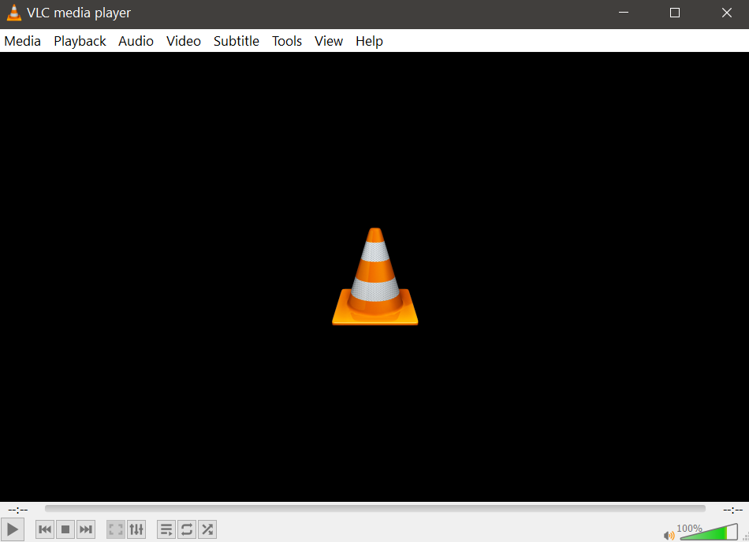
1. Click Tools on Menu Bar
1. Click on Preferences
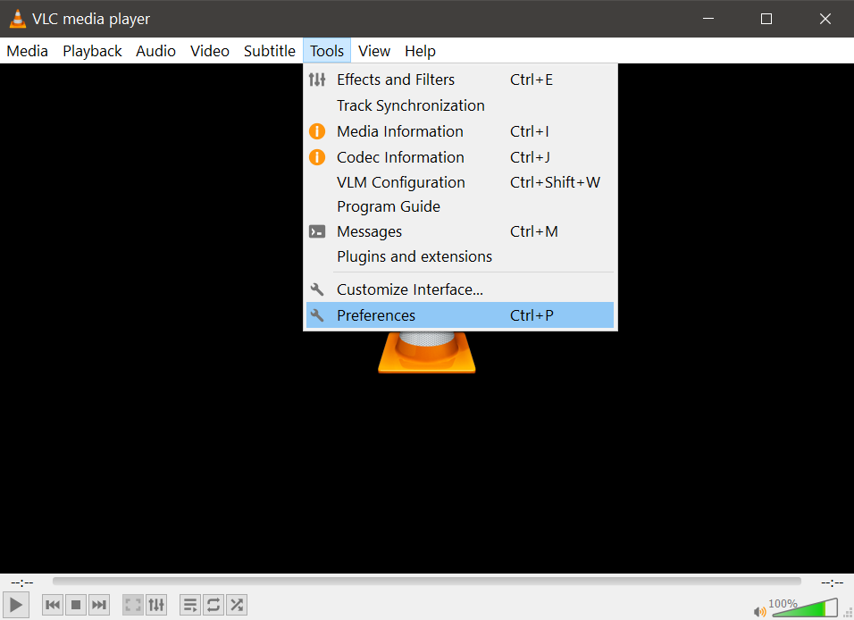
1. On the bottom left of popup window, under 'show settings' click on All
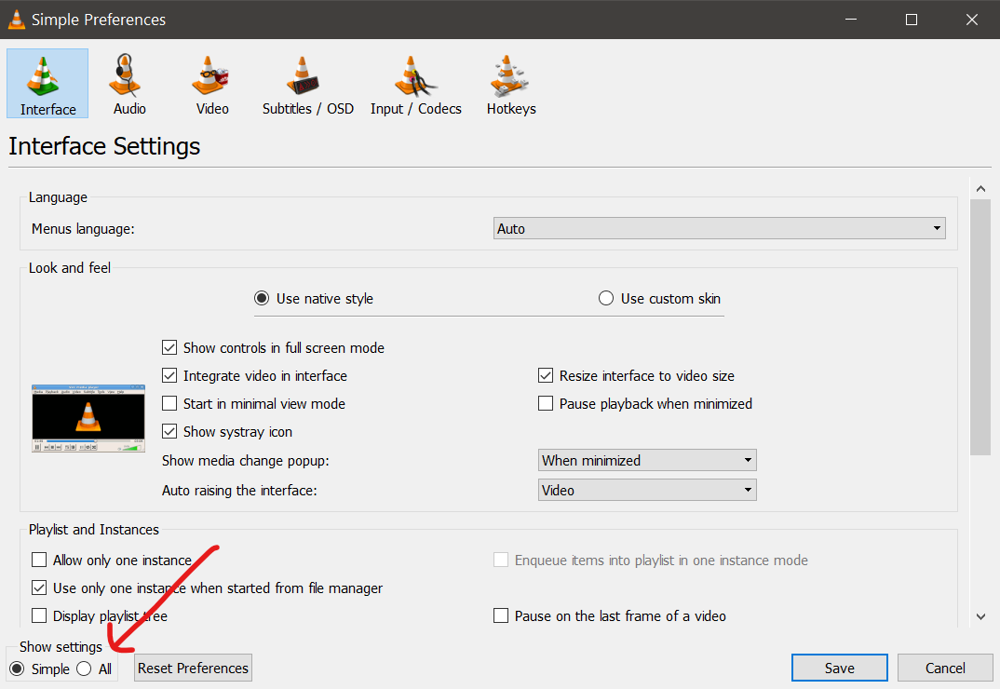
1. In the left menu expand 'Interfaces' and click on Main Interfaces
1. IMPORTANT: In main interfaces, checkmark on 'Telnet'
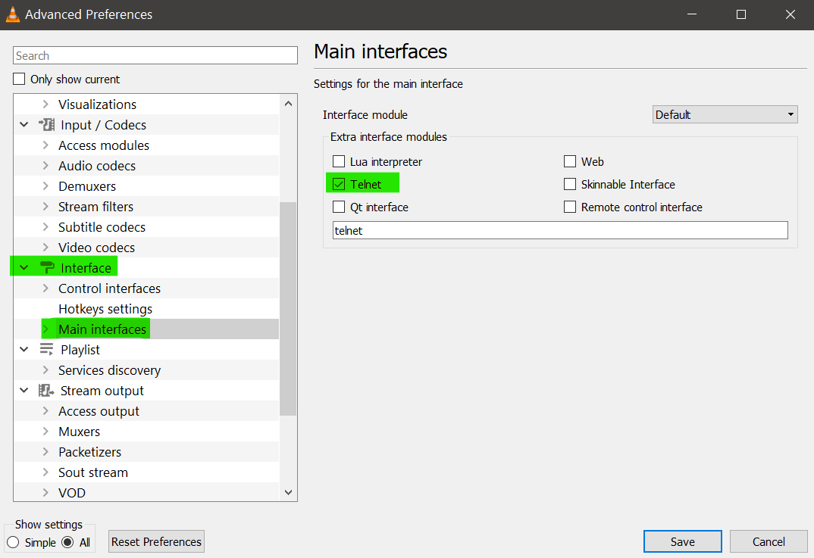
1. Expand 'Main Interfaces' on the left pane and click on 'Lua'
1. On the right pane configure 'Lua Telnet'
    1. Lua Interface: `dummy`
    1. Host: `localhost` or `127.0.0.1` for same computer or set remote IP
    1. Port: `4212` is default, you can leave it as is or configure any other port if required
    1. Password: Set your password
1. Click on Save
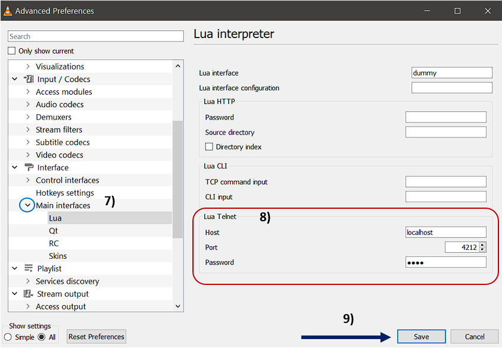
1. Restart VLC Media Player

#### MacOS

1. Open VLC Media Player
1. Click on VLC Media Player on menu bar to open the context menu and click on settings **OR** Press `Command + ,` 
1. On the bottom left of popup window click on "Show All"
1. In the left menu expand 'Interface' and click on Main Interfaces
1. **IMPORTANT:** In main interfaces, checkmark on 'Telnet'
1. Expand 'Main Interfaces' on the left pane and click on 'Lua'
1. On the right pane configure 'Lua Telnet'
    1. Lua Interface: `dummy`
    1. Host: `localhost` or `127.0.0.1` for same computer or set remote IP
    1. Port: `4212` is default, you can leave it as is or configure any other port if required
    1. Password: Set your password
1. Click on Save
1. Restart VLC Media Player

# Setup via Executables (Recommended way for Microsoft Windows and Linux):

## Microsoft Windows:

1. Put the `Setup.exe` and `SpeakToVLC.exe` files in your movies directory for easy access to run them while watching movies.
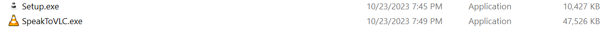
2. Double click to run `Setup.exe` (Microsoft Defender may block this file because it generates a simple plain text configuration file which the AI engine understands to be some malicious remote scripts but in real is only the configuration for your application to use). If blocked by Microsoft Defender then you need to make an exclusion for `Setup.exe` in Microsoft Defender. It's a false positive. [VirusTotal scan results](https://www.virustotal.com/gui/file/e45d14d2d81d30dce08d02c3061b159bffc29e44fa949d7e71817fc9dd545d02)

3. Go through the setup process:
    * **Host:** Set host or leave empty for default
    * **Port:** Set port or leave empty for default
    * **Noise adjustment:** Set your noise adjustment preference during voice command or leave empty for default
    * **Password:** Set your VLC Telnet interface password that you set in the above section
    * You'll get a `config.json` file in the same folder where you ran Setup from. This file contains the connection information for the voice command and VLC. It should always be in the same place as `SpeakToVLC.exe`.

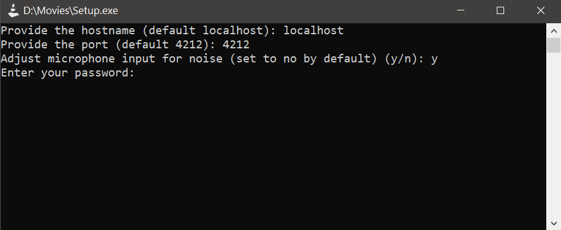

4. Play your favorite movie in VLC
5. Double-click to run `SpeakToVLC.exe`. [VirusTotal scan results](https://www.virustotal.com/gui/file/3baf9a360ed1fd9df34fff83f138855d9399aea00cffb4640beb797ae15348c6)
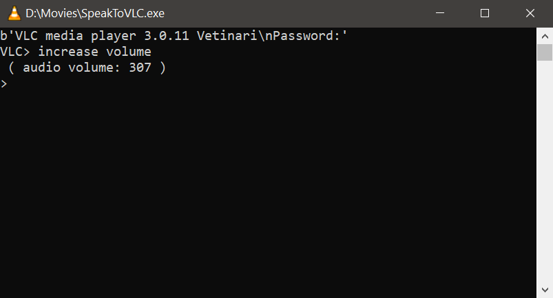
6. Enjoy ^_____^
7. If any errors are encountered then refer to troubleshooting.txt or create an [issue](https://github.com/DoofenCorp/Speak-to-VLC/issues)

## Linux:
1. Put the `Setup` and `SpeakToVLC` files in your movies directory for easy access to run them while watching movies.
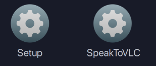
2. Right click in the folder and `Open Terminal`.
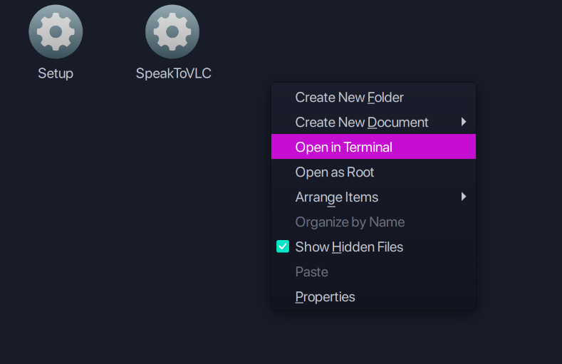
3. Type `./Setup` and press <kbd>Enter</kbd>. [VirusTotal scan results](https://www.virustotal.com/gui/file/59b169684e86bfab26a52c5151883cf5b2c76fc6e20c3ef4016f28c15670f130)
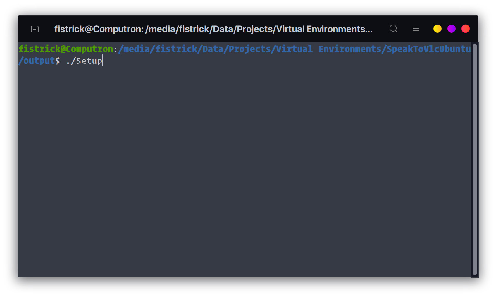
4. Go through the setup process:
    * **Host:** Set host or leave empty for default
    * **Port:** Set port or leave empty for default
    * **Noise adjustment:** Set your noise adjustment preference during voice command or leave empty for default
    * **Password:** Set your VLC Telnet interface password that you set in the above section
    * You'll get a `config.json` file in the same folder where you ran Setup from. This file contains the connection information for the voice command and VLC. It should always be in the same place as `SpeakToVLC.exe`.
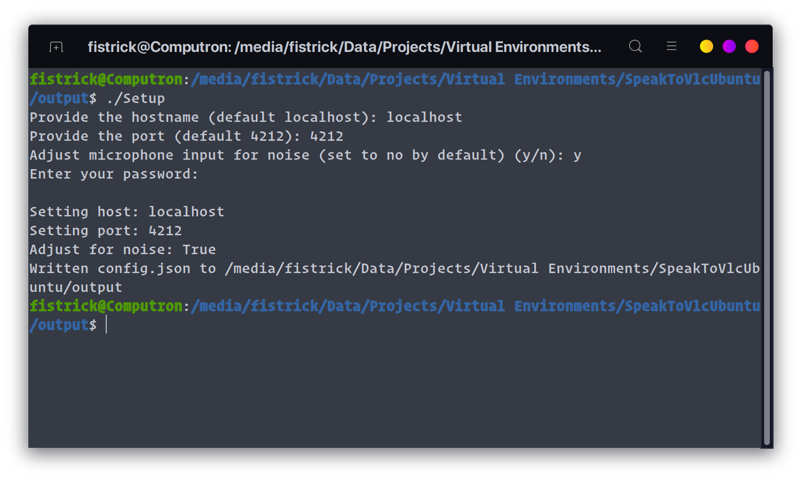
5. Play your favorite movie in VLC
6. Type `./SpeakToVLC` in the terminal and press <kbd>Enter</kbd>. [VirusTotal scan results](https://www.virustotal.com/gui/file/174ed1610501cafcd66ad4187f2f1629f8d9665cb73363644a1d3859f29cb52d)
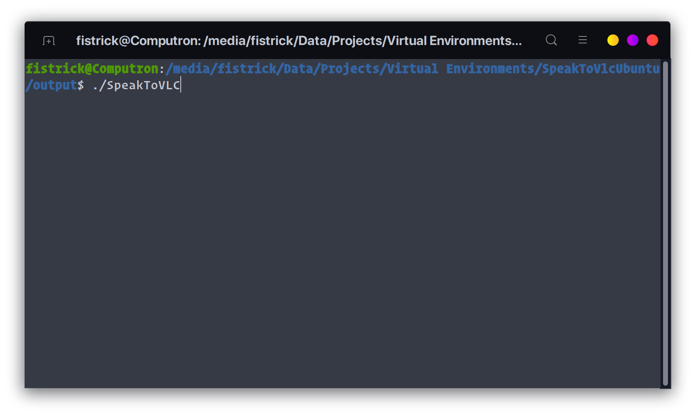

**Note:** You may get output like below and this is **totally normal** because of the everlasting issue of audio devices and linux.
```
ALSA lib pcm_dsnoop.c:566:(snd_pcm_dsnoop_open) unable to open slave
ALSA lib pcm_dmix.c:999:(snd_pcm_dmix_open) unable to open slave
ALSA lib pcm.c:2666:(snd_pcm_open_noupdate) Unknown PCM cards.pcm.rear
```

7. Enjoy ^_____^
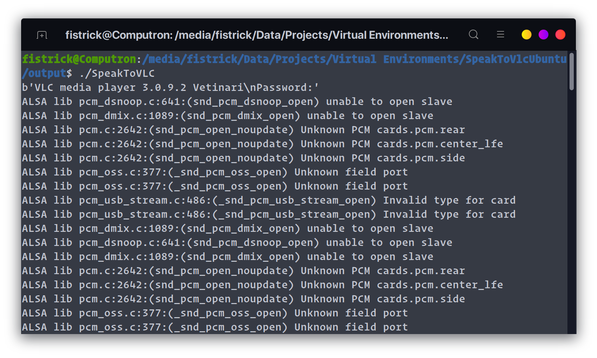
8. If any errors are encountered then refer to `troubleshooting.txt` or create an [issue](https://github.com/DoofenCorp/Speak-to-VLC/issues)

# OR Setup via Source (All platforms):

### 1. Install all requirements:

1. Install Python >= 3.8 and < 3.12 if not already installed. **IMPORTANT:** Choose to install pip along with the installation. Do not use Python 3.12 because the requirements will not build on that version due to updated semantics of Python.
1. * **Windows:** Double click to run `req.bat`
   * **Linux/MacOS:** Open terminal in current directory and type `chmod u+x req.sh` then `./req.sh` to install all requirements from requirements.txt 
* Note: Run the `req.bat` as Administrator on Windows if you have Python installed in `C:\Program Files\`. Similarly, try `sudo` mode for *nix/MacOS
* Internet connectivity for speech recognition
* Python 3.8+
* `cryptography` library
* `telnetlib3` module
* `SpeechRecognition` module
* `pyaudio` module
    * **Windows:** It'll install automatically with step 2.
    * **Debian/Ubuntu:**
        1. `sudo apt-get install -y portaudio19-dev`
        1. `sudo apt-get install python-pyaudio python3-pyaudio` 
    * **Redhat:**
        1. `sudo dnf install portaudio-devel redhat-rpm-config`
        1. `sudo pip3 install pyaudio`
            * If you encounter any error then try: `sudo dnf install python-pyaudio`
    * **MacOS:** 
        1. `brew install portaudio`
        2. `pip3 install pyaudio`

### 3. Generate configuration file to establish connection

1. Go to scripts directory
1. Run `setup.py`
1. Set host, port and password which were set in VLC media player in previous step
1. `config.json` will be generated

### 4. Connect Python to VLC

1. Launch VLC media player or play some media in VLC
1. Run `speaktovlc.py`
* You'll see the `VLC>` prompt to issue commands. 
(List of commands available in [commands.txt](commands.txt))

# Voice commands:

`play` - To play media

`pause`/`hold` - To pause playback

`stop` - To stop playback

`fullscreen` - Enter/Exit full screen

`shutdown` - Exit VLC

`increase volume` - Increase volume by 10%

`decrease volume` - Decrease volume by 10%

`stop listening` - Turns off voice command and closes SpeakToVLC

`faster` - Faster playback by 0.5x

`slower` - Slower playback by 0.5x

`normal` - Normal playback

Other simple commands listed in [commands.txt](commands.txt) also work. Complex to speak commands like `atrack` (for changing audio track) will be broken down into simple commands to implement their functionality in upcoming releases.

# Troubleshooting

[Additional resource](https://pypi.org/project/SpeechRecognition/#:~:text=install%20openai.-,Troubleshooting,-The%20recognizer%20tries)

This might address some errors you could encounter which aren't mentioned below

---

In the event of crash a `connection.log` file will be created in the directory from where the application was launched. Check it's contents and look below

---

## 1. Connection Refused Error
**Prompt:**

Windows: `ERROR __main__ [WinError 1225] The remote computer refused the network connection`

Linux: `ERROR __main__ [Errno 111] Connect call failed ('127.0.0.1', 4212)`

**Possible cause(s):** The IP Address of the host machine OR/AND port is incorrect OR/AND VLC Media Player is not running.

**Fix:**

(i) Delete `config.json`

(ii) Run `Setup.exe`/`Setup` and generate a new `config.json`

(iii) Additionally you can open `config.json` in text editor and verify the correct details

Common possible issues and fixes are listed in `troubleshooting.txt`

---

## 2. Configuration file not found error
**Prompt:** `ERROR __main__ [Errno 2] No such file or directory: 'config.json'`

**Possible cause:** You executed `SpeakToVLC.exe`/`SpeakToVLC` before `Setup.exe`/`Setup` hence, `config.json` doesn't exist yet.

**Fix:** Run `Setup.exe`/`Setup` and generate new `config.json` before running `SpeakToVLC.exe`/`SpeakToVLC`

---

## 3. JSONDecodeError
**Prompt:** `ERROR __main__ Expecting value: line 1 column 1 (char 0)`

**Possible cause:** The `config.json` file is empty.

**Fix:** Run `Setup.exe`/`Setup` and generate new `config.json` with correct details. Additionally, you can verify using a text editor that correct details are saved.

---

## 4. FLAC codec error in MacOS

**Fix:** Run `brew install flac` in terminal to install flac